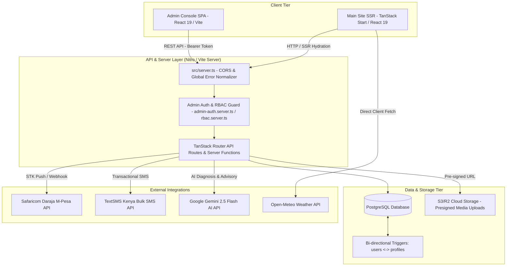

# Comprehensive System Architecture & Codebase Audit: Mqulima Platform

## 1. System Overview

Mqulima (Kirgit Agri) is a full-stack, multi-tenant agricultural technology and e-commerce platform tailored for East African farmers, agro-dealers, and agribusinesses. Built as a monorepo workspace (`bun` / `npm` workspace), the system comprises a public SSR web application (powered by TanStack Start, TanStack Router, React 19, and Vite/Nitro), a standalone client-side Admin Console SPA (`/admin`, built with React 19 and Vite), an API layer hosted via TanStack Start server functions and HTTP handlers, and a PostgreSQL database managed via raw SQL queries (`postgres` driver) alongside Drizzle ORM schemas. The platform integrates real-time M-Pesa STK Push payments, TextSMS Kenya bulk transactional SMS notifications, Google Gemini AI crop diagnostic models, Open-Meteo weather intelligence, and S3-compatible cloud storage for media upload presigning.



---

## 2. Frontend Architecture (Main Public Site)

### 1. Directory Structure & Responsibilities
- `src/start.ts`: Server startup entry point configuring `@tanstack/react-start` request middleware and catastrophic error handling.
- `src/server.ts`: Low-level server fetch handler normalizing Nitro/h3 HTTP responses, enforcing CORS headers across allowed origins (`www.mqulima.com`, `mqulima.vercel.app`, `admin`), and catching unhandled SSR errors.
- `src/router.tsx`: TanStack Router configuration declaring router instance, default preloading (`intent`), and scroll restoration settings.
- `src/routes/`: File-based routes automatically compiled into `src/routeTree.gen.ts`.
  - `__root.tsx`: Top-level application wrapper containing `AppLayout`, `Navbar`, `Footer`, `AuthProvider`, `CartProvider`, `WhatsAppButton`, and global toast container.
  - `index.tsx`: Main landing page featuring `HeroCarousel`, `StatsBar`, `CategoryGrid`, `FeaturedProducts`, `ServicesOverview`, and testimonial sections.
  - `shop.tsx` & `shop/`: Agro-marketplace listing products, category filters, cart modal (`CartDrawer`), checkout flow, and M-Pesa payment prompt.
  - `academy.tsx`: Agricultural masterclass modules, video player stubs, chapter navigation, and lesson progress indicators.
  - `community.tsx`: Social forum (Show/Pulse) supporting posts, comments, likes, tags, author badges, and moderation flags.
  - `ai.tsx`: Interactive AI Crop Doctor workspace supporting image uploads, plant diagnostic chat, and farming recommendations.
  - `services.tsx`: Agribusiness services booking platform with WhatsApp quotation integration.
  - `tools.tsx`: Weather forecasting and market price tracking widgets.
  - `auth.sign-in.tsx` & `auth.sign-up.tsx`: Farmer authentication screens.
- `src/components/`: Reusable UI components categorized into `mqulima/` (branding/layout), `shop/` (cart, product cards), `ui/` (Radix UI / Shadcn primitives), and `community/`.
- `src/lib/`: Frontend utilities, React contexts (`cart-context.tsx`, `auth-context.ts`), and client-side helpers (`csrf-client.ts`).

### 2. Key Entry Points
- **Client Hydration**: `src/router.tsx` and `src/routes/__root.tsx`.
- **SSR Server Boot**: `src/start.ts` → `src/server.ts` → `@tanstack/react-start/server-entry`.

### 3. Data Flow
1. User navigates to a route (e.g., `/shop` or `/community`).
2. TanStack Router executes `loader` functions or server functions (`createServerFn`) defined in `src/lib/api/*.server.ts`.
3. Server functions execute on the server, invoking `getDb()` SQL queries against PostgreSQL.
4. Server returns structured JSON payload; HTML is pre-rendered on the server (SSR) and streamed to client.
5. Client hydrates React tree, initializing `CartContext` and `AuthContext` from HTTP cookies (`mq_session`) or `localStorage`.

### 4. Auth & Session Handling
- Session state is persisted in an HTTP-Only cookie `mq_session` containing a JWT signed with `JWT_SECRET` via `jose`.
- CSRF protection relies on `csrf-client.ts` and `csrf-verify.server.ts`, generating a double-submit cookie token.
- User roles (`farmer`, `retailer`, `admin`) are embedded in the JWT payload and validated in `auth-server.ts`.

### 5. Environment & Config Dependencies
- `DATABASE_URL`: Required for SSR data fetching.
- `JWT_SECRET`: Required for signing and verifying user session tokens.
- `VITE_APP_URL` / `NEXT_PUBLIC_APP_URL`: App origin required for auth callback redirects and canonical URLs.

### 6. Tech Debt & Dead Code
- `src/routes/login.tsx`: Legacy stub file consisting of only 220 bytes that simply redirects to `/auth/sign-in`.
- Heavy inline CSS and duplicate state management inside `src/routes/community.tsx` (over 327KB in a single file!).
- Mixture of TanStack Router loaders and client-side `useEffect` data fetches across routes.

---

## 3. Admin Console Architecture

### 1. Directory Structure & Responsibilities
- `admin/package.json`: Independent workspace package (`mqulima-admin`) specifying React 19, Tailwind CSS v4, Lucide React, and `jsPDF`.
- `admin/vite.config.ts`: Vite SPA configuration setting port `8081`, strict port binding, `@` alias pointing to `admin/src`, and `/api` proxy targeting `http://localhost:8080`.
- `admin/src/main.tsx`: Client root entry point mounting `App.tsx` inside `StrictMode` and suppressing browser extension noise.
- `admin/src/App.tsx`: Main admin controller handling layout structure (`Topbar`, `Sidebar`), authentication session checks (`mqulima_admin_session`), and lazy-loaded module routing.
- `admin/src/lib/api.ts`: Central HTTP client wrapper (`adminFetch`) attaching `Authorization: Bearer <token>` headers and handling global `401 Unauthorized` session expiry events.
- `admin/src/components/auth/AdminLoginScreen.tsx`: Executive authentication portal with credential submission and role validation.
- `admin/src/components/layout/`: `Topbar.tsx` (user avatar, role display, logout trigger) and `Sidebar.tsx` (obsidian-emerald side navigation).
- `admin/src/components/modules/`: 14 dedicated management modules:
  - `DashboardHomeModule.tsx`: Executive platform live activity feed, quick metrics, and operational calendar.
  - `CustomersModule.tsx`: Farmer profile management, farming fields, ID verification, and deletion.
  - `ProductsStockModule.tsx`: Catalog pricing, inventory adjustments, and status toggles.
  - `OrdersQuotationsModule.tsx`: Order processing, status updates, and sales quotations.
  - `PaymentsModule.tsx`: Financial transaction ledger, M-Pesa status checks, orphaned payment matching, and PDF financial statements.
  - `ServiceRequestsModule.tsx`: Agronomy & mechanization request management.
  - `NewsCMSModule.tsx`: Agri-news publishing, draft management, and deletion.
  - `ForumModerationModule.tsx`: Moderation queue for flagged posts/comments.
  - `CommodityTrendsModule.tsx`, `InquiriesModule.tsx`, `AcademyExtensionModule.tsx`, `AIForecastsModule.tsx`, `FeaturedCollectionModule.tsx`.

### 2. Key Entry Points
- **Application Boot**: `admin/src/main.tsx` → `admin/src/App.tsx`.
- **API Client**: `admin/src/lib/api.ts` (`adminFetch`).

### 3. Data Flow
1. Admin user logs in via `AdminLoginScreen.tsx`, dispatching `POST /api/admin/login`.
2. Server validates credentials against `profiles` table (role checked against `admin`, `super_admin`, `sales_agent`, `content_editor`), returns a JWT token and user profile object.
3. Client stores token in `localStorage.getItem("mqulima_admin_token")` and session details in `mqulima_admin_session`.
4. Admin modules invoke `adminFetch("/api/admin/<module>")`, sending the JWT Bearer token.
5. Server executes `requireAdminAuth(request)` (`src/lib/api/admin-auth.server.ts`), queries database, and responds with JSON.
6. If API returns `401 Unauthorized`, `adminFetch` dispatches custom event `admin_unauthorized`, clearing storage and redirecting to login.

### 4. Auth & RBAC Flow
- **Token Management**: JWT Bearer token passed in `Authorization` header or HTTP cookie `mq_session`.
- **Role Enforcement**: `src/lib/rbac.server.ts` defines explicit role levels (`super_admin`: 100, `admin`: 90, `operations_manager`: 80, `finance`: 75, `content_editor`: 70, `support_agent`: 65, `sales_agent`: 60) and scope permissions (`customers:read/write`, `payments:read/write`, `forum:moderate`, etc.).

### 5. Environment & Config Dependencies
- **Development**: Relies on Vite proxy (`/api` → `http://localhost:8080`).
- **Production**: Requires host web app to handle `/api/admin/*` routing or serverless API function dispatch.

### 6. Tech Debt & Dead Code
- Legacy duplicate files in main app's `src/lib/api/admin-*.server.ts` vs `src/routes/api/admin/*.ts`.
- Direct `localStorage` key dependency (`mqulima_admin_token`) without token refresh mechanism.

---

## 4. Backend / API Architecture

### 1. Directory Structure & Responsibilities
- `src/server.ts`: Central server entry point wrapping Nitro/Vite HTTP engine.
- `src/routes/api/`: File-based REST API endpoints:
  - `admin/`: Executive management endpoints (`login.ts`, `customers.ts`, `products.ts`, `orders.ts`, `payments.ts`, `news.ts`, `forum-moderation.ts`, `services.ts`, `inquiries.ts`, `analytics.ts`, `logistics.ts`, `market-prices.ts`, `commodity-trends.ts`, `featured.ts`, `academy.ts`, `ai-forecasts.ts`, `quotations.ts`).
  - `mpesa/callback.ts`: Safaricom Daraja STK Push webhook callback listener.
  - `ai/chat.ts`: Streaming/JSON AI chat handler integrating Google Gemini API.
  - `upload/presign.ts`: Cloud storage S3/R2 presigned upload URL generator.
- `src/lib/api/`: Server function logic (`*.server.ts`) consumed by TanStack Router loaders and client calls:
  - `admin-auth.server.ts`: Admin JWT extraction and session guard.
  - `admin-services.server.ts` & `admin-shop.server.ts`: Admin database execution helpers.
  - `shop.server.ts`, `products.server.ts`, `community.server.ts`, `crop-doctor.server.ts`, `academy-public.server.ts`, `user-notifications.server.ts`, `market-sync.server.ts`.
- `src/lib/db.server.ts`: Global PostgreSQL database pool connection instance created via `postgres` (pnpm `postgres` package).
- `src/lib/rbac.server.ts`: Role-Based Access Control logic and scope assertion middleware.
- `src/lib/rate-limit.server.ts`: Upstash Redis rate-limiting service protecting public endpoints against brute force.

### 2. Key Entry Points
- **API Server Entry**: `src/server.ts` → TanStack Router API handler (`createFileRoute("/api/...")`).
- **DB Connection**: `src/lib/db.server.ts` (`getDb()`).

### 3. Data Flow (Client → API → DB → Response)
```
[Client App / Admin Console]
       │  (Fetch GET/POST with Bearer Token / Cookie)
       ▼
[src/server.ts] (CORS Check & Error Normalization)
       │
       ▼
[src/routes/api/<endpoint>.ts] (Route Handler)
       │
       ├─► [requireAdminAuth / getAuthAdminUserFromRequest] (Auth Guard)
       ├─► [Zod Schema Validation] (Input Sanitization)
       │
       ▼
[src/lib/db.server.ts] (postgres SQL tagged template literals)
       │
       ▼
[PostgreSQL Database]
       │
       ▼
[JSON Response returned to Client with appropriate HTTP Status & Headers]
```

### 4. Auth & RBAC Flow
- User roles: `super_admin`, `admin`, `operations_manager`, `finance`, `content_editor`, `support_agent`, `sales_agent`, `retailer`, `farmer`.
- Authentication is verified on every administrative API request using `requireAdminAuth(request)`. If missing or invalid, an HTTP `401 Unauthorized` JSON payload is immediately returned.

### 5. Environment & Config Dependencies
- `DATABASE_URL`: Connection string to PostgreSQL instance.
- `JWT_SECRET`: Mandatory secret key for JWT validation.
- `UPSTASH_REDIS_REST_URL` & `UPSTASH_REDIS_REST_TOKEN`: Optional rate-limiting credentials.

### 6. Tech Debt & Dead Code
- Dual SQL querying paradigms: Raw SQL tagged templates (`sql`...`` via `postgres`) vs Drizzle ORM (`drizzle-orm`).
- Inconsistent error format between server functions (returning `{ success: false, error: "..." }`) and raw API routes (returning `Response` objects).

---

## 5. Database Schema & Architecture

### Database Schema Table

| Table Name | Primary Key | Key Foreign Keys | Purpose / Responsibilities | Indexes & Constraints | Flagged Issues / Gaps |
| :--- | :--- | :--- | :--- | :--- | :--- |
| `users` | `id` (UUID) | None | Farmer/Customer primary authentication record | `phone_number` UNIQUE, `email` UNIQUE, `national_id` UNIQUE | Redundant with `profiles` table; requires SQL trigger sync |
| `profiles` | `id` (UUID) | None | Unified user profiles (farmers, admins, editors, retailers) | `email` UNIQUE, `username` UNIQUE, `role` ENUM | Password hash duplicated from `users` table |
| `products` | `id` (UUID) | `category_id` → `product_categories.id` | Marketplace agricultural products catalog | `slug` UNIQUE, `category_id` FK | `image_urls` stored as text array; prices as numeric(12,2) |
| `product_categories` | `id` (UUID) | `parent_category_id` → `product_categories.id` | Hierarchical product categorization | `slug` UNIQUE | Self-referencing FK hierarchy |
| `product_variants` | `id` (UUID) | `product_id` → `products.id` | SKU variations for product sizing/packaging | `product_id` FK (CASCADE) | Few products currently populate variants |
| `orders` | `id` (UUID) | `user_id` → `profiles.id`, `sales_agent_id` → `profiles.id` | Customer purchase orders | `user_id` FK, `sales_agent_id` FK | Items stored as `jsonb` AND in `order_items` table (redundancy) |
| `order_items` | `id` (UUID) | `order_id` → `orders.id`, `product_id` → `products.id` | Itemized product breakdown per order | `order_id` FK, `product_id` FK | Correctly cascade-deleted with order |
| `payments` | `id` (UUID) | `order_id` → `orders.id` | M-Pesa & manual transaction payment ledger | `order_id` FK, `status` ENUM | Stores raw M-Pesa callback JSON in `raw_payload` |
| `quotations` (App) | `id` (UUID) | `user_id` → `profiles.id`, `sales_agent_id` → `profiles.id` | Official buyer quotations | `user_id` FK | Table name collides with `adminQuotations` schema! |
| `quotations` (Admin) | `id` (VARCHAR) | `customer_id` (VARCHAR string) | Admin-managed quotations | Primary key is `varchar(255)` | **CRITICAL SCHEMA COLLISION**: Two schemas map to `quotations`! |
| `show_posts` | `id` (UUID) | `user_id` → `profiles.id`, `author_id` → `profiles.id` | Community forum show/moment posts | `user_id` FK, `author_id` FK | Redundant `user_id` and `author_id` foreign keys |
| `show_comments` | `id` (UUID) | `post_id` → `show_posts.id`, `user_id` → `profiles.id` | Comments on forum posts | `post_id` FK, `user_id` FK | Simple 1-level depth comments |
| `show_likes` | `id` (UUID) | `post_id` → `show_posts.id`, `user_id` → `profiles.id` | Post likes tracking | `post_id` FK, `user_id` FK | Lacks composite UNIQUE constraint `(post_id, user_id)` |
| `pulse_posts` | `id` (UUID) | `author_id` → `profiles.id` | Curated agricultural news feed | `author_id` FK | Duplicate responsibility with `agritech_news` table |
| `agritech_news` | `id` (VARCHAR) | `author_id` (VARCHAR) | Admin-published news & CMS articles | `slug` VARCHAR | PK is `varchar(255)` instead of UUID |
| `services` | `id` (UUID) | None | Catalog of services (soil test, tractor hire) | `slug` UNIQUE | Static service definitions |
| `service_requests` | `id` (UUID) | `user_id` → `profiles.id`, `service_id` → `services.id` | Customer service booking requests | `user_id` FK, `service_id` FK | `service_id` nullable for guest requests |
| `academy_courses` | `id` (UUID) | `author_id` → `profiles.id` | Masterclass course catalog | `slug` UNIQUE | Unified course content stored in `full_content` markdown |
| `academy_chapters` | `id` (UUID) | `course_id` → `academy_courses.id` | Course chapters/modules | `course_id` FK | Partially deprecated in favor of unified markdown |
| `academy_lesson_progress` | `id` (UUID) | `user_id` → `profiles.id`, `lesson_id` → `academy_chapters.id` | User lesson completion records | `user_id` FK, `lesson_id` FK | Lacks composite UNIQUE constraint `(user_id, lesson_id)` |
| `admin_audit_logs` | `id` (VARCHAR) | None | Admin action audit trail | `actor_id` index | Uses VARCHAR string IDs |
| `logistics_records` | `id` (VARCHAR) | `order_id` → `orders.id` (UUID) | Order dispatch and courier tracking | `order_id` FK | `order_id` fixed to UUID in migration 00047 |
| `market_price_overrides` | `id` (VARCHAR) | None | Manual commodity market price adjustments | `commodity_name` index | Uses VARCHAR string IDs |
| `ai_query_logs` | `id` (VARCHAR) | None | AI Diagnostic query logging | `user_id` index | Uses VARCHAR string IDs |
| `sms_logs` | `id` (UUID) | None | Transactional SMS dispatch history | `status` index | Stores recipient, trigger type, and API response JSON |
| `farmer_followers` | `id` (UUID) | `farmer_id` → `profiles.id`, `follower_id` → `profiles.id` | Social follower relationships | FKs to `profiles.id` | Lacks composite UNIQUE constraint `(farmer_id, follower_id)` |
| `moderation_reports` | `id` (UUID) | `reporter_id` → `profiles.id` | Content moderation flag queue | `reporter_id` FK | Stores target entity type & ID |

### Dual User Tables Architecture & Trigger Synchronization
The database maintains two distinct user tables: `users` (holding structured Kenyan identity fields like `first_name`, `last_name`, `national_id`, `county`, `farming_type`) and `profiles` (holding platform-wide social profiles, roles, avatars, reputation scores, and bio).
They are kept in sync bi-directionally via PostgreSQL triggers:
1. `sync_users_to_profiles()`: Executed `AFTER INSERT OR UPDATE OR DELETE ON users`. Automatically creates or updates the corresponding `profiles` row.
2. `sync_profiles_to_users()`: Executed `AFTER UPDATE ON profiles`. Syncs profile detail changes back to `users`.
3. Loop Prevention: Both triggers check `IF pg_trigger_depth() > 1 THEN RETURN NEW; END IF;` to prevent infinite recursive trigger invocation.

### Migration Anomaly Analysis
1. **Duplicate Migration Sequence Numbers**:
   - `00025_forum_bookmarks_replies.sql` AND `00025_sync_profiles_to_users.sql`
   - `00026_add_show_post_type_values.sql` AND `00026_hard_delete_sync_trigger.sql`
2. **Missing Migration Numbers**:
   - Migration `00038_enhance_service_requests_schema.sql` is directly followed by `00041_production_performance_indexes_and_constraints.sql` (Sequence numbers `00039` and `00040` are completely missing).
3. **Data Type Mismatches**:
   - Drizzle schema files in `src/db/schema/admin.ts` declare primary keys as `varchar(255)` while core tables use `uuid`.

---

## 6. Integration Points & Status

### 1. M-Pesa Daraja Payment Gateway
- **Implementation Files**: `src/lib/api/mpesa.server.ts`, `src/lib/mpesa-helpers.server.ts`, `src/routes/api/mpesa/callback.ts`.
- **Status**: **Fully Wired & Production-Ready**.
- **Data Flow**: Client submits checkout → Server normalizes phone to `254XXXXXXXXX` format → Fetches OAuth access token from Safaricom Daraja API (`/oauth/v1/generate`) → Generates base64 STK password (`Shortcode + Passkey + Timestamp`) → Dispatches `stkpush/v1/processrequest` → Creates `pending` record in `payments` table → Safaricom sends asynchronous HTTP POST callback to `/api/mpesa/callback` → Callback verifies webhook secret token, updates `payments` status to `completed` or `failed`, updates `orders` payment status, and logs event.
- **Fallbacks**: Auto-retry once on token rejection; sandbox fallback credentials provided if environment variables are missing.

### 2. TextSMS Kenya Bulk SMS API
- **Implementation Files**: `src/lib/sms-service.server.ts`, `src/routes/api/admin/customers.ts`, `src/routes/api/admin/orders.ts`.
- **Status**: **Fully Wired with Graceful Mock Fallback**.
- **Data Flow**: Triggered during signup welcome, order confirmation, and payment receipt events → Normalizes Kenyan mobile number → Checks `TEXTSMS_MOCK_MODE` (if true or API key missing, logs simulation to console and records `mocked` in `sms_logs`) → Sends HTTP POST request to `https://sms.textsms.co.ke/api/services/sendsms/` with partner ID, shortcode (`KIRGIT_AGRI`), mobile, and message → Logs result asynchronously to `sms_logs` database table.

### 3. Google Gemini AI API (Crop Doctor & Advisory)
- **Implementation Files**: `@google/genai` package, `src/lib/api/ai.server.ts`, `src/routes/api/ai/chat.ts`.
- **Status**: **Wired with Fallback Diagnostic Engine**.
- **Data Flow**: User submits crop photo or text inquiry in AI workspace → Server initializes `@google/genai` client using `GEMINI_API_KEY` → Executes Gemini 2.5 Flash vision model prompt → Parses JSON diagnostic output (disease identified, confidence score, organic treatments, chemical controls, prevention) → Falls back to offline agronomic rule-based diagnostic engine if API key is invalid or quota is exceeded.

### 4. Open-Meteo Weather API
- **Implementation Files**: `src/lib/weather-service.ts`, `src/routes/tools.tsx`.
- **Status**: **Fully Wired (Public API, No Credentials Required)**.
- **Data Flow**: Client fetches current weather, 7-day agricultural forecast, evapotranspiration rates, and soil moisture indices for Kenya's 47 counties directly from Open-Meteo REST API.

### 5. Cloud Media Storage (S3 / R2 Presigned Uploads)
- **Implementation Files**: `src/routes/api/upload/presign.ts`, `src/services/storage/s3-signer.service.ts`.
- **Status**: **Wired / Configured with Mock Presign Fallback**.
- **Data Flow**: Client sends request for presigned upload URL with file name, type, size, and category → Server validates payload with Zod → If S3 credentials (`S3_ACCESS_KEY_ID`, `S3_SECRET_ACCESS_KEY`) are present, signs AWS S3 v4 PUT URL → If missing, generates local mock upload URL string.

### 6. Upstash Redis Rate Limiting
- **Implementation Files**: `src/lib/rate-limit.server.ts`, `src/routes/api/admin/login.ts`.
- **Status**: **Wired with Graceful Pass-Through Fallback**.
- **Data Flow**: Limits authentication and submission attempts per IP address using `@upstash/ratelimit` and `@upstash/redis`. If Redis environment variables are unconfigured, rate limiting gracefully logs a warning and passes requests through without crashing.

---

## 7. Git History Summary & Churn Analysis

### Summary of Commit History by Feature Area / Module
- **Auth, Security & RBAC Hardening**: Standardized admin JWT authorization, strict CORS origin matching in `server.ts`, CSRF double-submit token cookies, and RBAC permission checks across API endpoints.
- **Admin Console CMS & Executive Dashboard**: Built 14 dedicated management modules, modern obsidian-emerald navigation sidebar, customer management with farming fields, live activity feed, and jspdf report exports.
- **Database Architecture & Migrations**: Created 47 SQL migration files, bi-directional `users` <-> `profiles` triggers, production seeding scripts (`seeds.sql`), and schema alignment patches.
- **Shop & M-Pesa Payment Infrastructure**: Built agro-marketplace, cart context drawer, dynamic Safaricom M-Pesa STK push integration, webhook callback handler, and payment reconciliation ledger.
- **Community Forum & Social Features**: Implemented Show (moments) and Pulse (news) feeds, user likes, comments, author badges, and administrative moderation reporting queue.
- **Homepage & UI Overhauls**: Replaced static components with dynamic database-driven featured items, continuous hero carousel, animated stats count-up bar, and mobile responsive viewports.

### Last 20 Commits Functional Breakdown

| Commit SHA | Date | Functional Change Summary | Risk / Impact Area |
| :--- | :--- | :--- | :--- |
| `e2cf5bf` | 2026-08-13 | Added `jspdf` dependency to `admin/package.json` to fix Vercel standalone build | Admin Deployment |
| `a73253a` | 2026-08-12 | Redirected user to homepage (`/`) after successful sign-in or registration | Auth Flow |
| `4381720` | 2026-08-12 | Added migration 00047 (`order_id` UUID type in logistics), removed auto-seed mock data | Database Schema |
| `7b2653c` | 2026-08-12 | Unified main site & admin news queries to `agritech_news` table; preserved deletions | Content CMS |
| `17b36f9` | 2026-08-12 | Included authentic agri-news articles in `db/seeds.sql` for clean environment init | DB Seeding |
| `a797414` | 2026-08-12 | Resolved SSL configuration and wrapped order auto-seeding to prevent HTTP 500 errors | DB Stability |
| `c24cc6e` | 2026-08-12 | Resolved admin customer join logic, added customer deletion, handled enum queries | Admin Customers |
| `c2d7236` | 2026-08-11 | Resolved horizontal viewport overflow on mobile devices (`overflow-x-hidden`) | Mobile UI |
| `1abaa40` | 2026-08-11 | Updated Operations Calendar date highlighting to dynamically target live system date | Admin Dashboard |
| `500671c` | 2026-08-11 | Standardized admin auth, RBAC, payment stock restoration, and production hardening | Security & Auth |
| `5b8173d` | 2026-08-01 | Decoupled featured collection products from standard catalog stock listings | Shop CMS |
| `e74afda` | 2026-08-01 | Revamped admin sidebar to concrete solid green design with enlarged typography | Admin UI |
| `8750702` | 2026-08-01 | Added `ON CONFLICT DO NOTHING` in autoPatchSchema to prevent resurrecting deleted items | DB Synchronization |
| `f30bd00` | 2026-08-01 | Enabled auto-scrolling for featured collection carousel on homepage | Homepage UI |
| `089f861` | 2026-08-01 | Executed direct production Render DB seeding and auto-upsert of featured products | DB Deployment |
| `044ef86` | 2026-08-01 | Seeded authentic featured products locally and enabled automatic production auto-seeding | DB Seeding |
| `1ea12a3` | 2026-08-01 | Removed hardcoded featured array and connected carousel exclusively to database | Shop Data |
| `f76e1f4` | 2026-08-01 | Replaced placeholder photos with certified seed imagery and added image error fallbacks | Media Assets |
| `5f4637b` | 2026-08-01 | Decoupled featured collection items into standalone showcase display entities | Shop Architecture |
| `2eac0ed` | 2026-08-01 | Removed hover/touch image zoom effects across product cards to fix mobile scroll | Mobile UX |

### Flagged Commits (Unresolved WIP, Reverts, Hotfixes)
- Commit `ea19405`: "fix: provide resilient fallback secret for JWT verification in admin server functions". (Hardcodes a fallback secret in production code if `JWT_SECRET` is unset — high security risk!).
- Commit `8750702` & `089f861`: Auto-patch schema running on startup and injecting seeds directly into production DB.
- Commit `0ac6458`: "chore(admin): trigger fresh Vercel build v1.0.1" (Empty build trigger commit without code changes).

### Churn Hotspots (Top 10 Most Modified Files in Git History)
1. `src/routeTree.gen.ts` (22 changes) — Auto-generated TanStack route tree (high churn expected).
2. `src/components/mqulima/Navbar.tsx` (21 changes) — Navigation layout, mobile drawer, and link revisions.
3. `src/components/mqulima/Footer.tsx` (18 changes) — Branding signatures and link updates.
4. `src/routes/index.tsx` (15 changes) — Homepage section redesigns and DB integrations.
5. `src/routes/__root.tsx` (14 changes) — Context provider wrappers and global layout.
6. `src/styles.css` (13 changes) — CSS styling rules and Tailwind additions.
7. `src/routes/shop.tsx` (12 changes) — Marketplace layout and cart drawer state.
8. `admin/src/lib/db-functions.ts` (11 changes) — Legacy admin database utility functions.
9. `src/routes/community.tsx` (10 changes) — Massive 327KB community route file.
10. `src/lib/shop-data.ts` (10 changes) — Product catalog definitions and seed data.

### Commit Message Quality Gaps
- Between commit `65e96a3` and `74942cf` (June 2026), **21 commits** were made with the non-descriptive message `"Changes"`. This severely impedes historical root-cause analysis for changes committed during that timeframe.

---

## 8. Risks & Gaps (Ranked by Severity)

### Critical Severity
1. **Quotations Table Schema Name Collision**:
   - `src/db/schema/orders.ts` defines `quotations` table with UUID primary key.
   - `src/db/schema/admin.ts` defines `adminQuotations` mapped to table name `"quotations"` with `varchar(255)` primary key.
   - *Impact*: Direct Drizzle ORM schema collision causing migration failures and query runtime errors.
2. **Hardcoded JWT Secret Fallback**:
   - `src/lib/config.server.ts` and legacy admin helpers fallback to `"mqulima-jwt-secret-key-production-2026-secure"` if `JWT_SECRET` environment variable is missing.
   - *Impact*: Anyone aware of the repo can forge administrative JWT session tokens and hijack admin accounts.

### High Severity
3. **Dual User Schema Maintenance (`users` vs `profiles`)**:
   - User identity data is split across two tables linked by SQL triggers (`sync_users_to_profiles` and `sync_profiles_to_users`).
   - *Impact*: Potential for sync desynchronization, trigger lock contention under heavy concurrency, and developer confusion regarding which table to query.
4. **Migration Sequence Number Duplication and Gaps**:
   - Two `00025_*.sql` and two `00026_*.sql` migration files exist in `db/migrations`.
   - Migration sequence jumps from `00038` directly to `00041` (Missing `00039` and `00040`).
   - *Impact*: Database migration runners executing strictly by numeric sort will execute out-of-order or fail on clean deployments.
5. **Massive Single-File Component Technical Debt**:
   - `src/routes/community.tsx` is **327,758 bytes** (over 8,000 lines of code) containing entire UI, modals, state hooks, and API fetches in one file.
   - *Impact*: Extremely fragile, difficult to refactor, slow IDE performance, high risk of regressions.

### Medium Severity
6. **Mismatched Primary Key Data Types**:
   - Core tables use `uuid` primary keys; admin schema tables (`agritech_news`, `admin_audit_logs`, `market_price_overrides`, `ai_query_logs`) use `varchar(255)`.
   - *Impact*: Inability to establish formal foreign key constraints between admin logs/news and core profiles/orders.
7. **Client-Side Session Token Storage**:
   - Admin console stores JWT tokens in `localStorage.getItem("mqulima_admin_token")`.
   - *Impact*: Vulnerable to Cross-Site Scripting (XSS) token extraction compared to HTTP-Only `SameSite=Strict` cookies.

### Low Severity
8. **PWA Service Worker Bypassing API Routes**:
   - Service worker forcibly unregisters or bypasses `/api/*` routes; push notifications are stubbed.
9. **Dead Code & Unused Stubs**:
   - `src/routes/login.tsx` is an empty redirect stub.

---

## 9. Open Questions (Requires User / Manual Clarification)

1. **User Identity Strategy**: Should `users` and `profiles` tables be merged into a single unified `profiles` table to eliminate bi-directional trigger overhead, or is the distinction between farmer registration data and social profiles intentional?
2. **Production Hosting Topology**: Is the system intended to deploy as a single unified Vercel deployment (running both main site and admin SPA via Nitro server preset) or split across Vercel (Frontend SSR) and Render (Node API server + PostgreSQL DB)?
3. **SMS Service Provider Credentials**: Is `TextSMS Kenya` the permanent bulk SMS vendor for production launch, and will live API credentials (`TEXTSMS_API_KEY`, `TEXTSMS_PARTNER_ID`) be provisioned to replace mock mode (`TEXTSMS_MOCK_MODE=true`)?
4. **Cloud Media Storage**: Should S3/R2 presigned upload credentials be provisioned for user profile photo and crop diagnosis uploads, or will media assets continue to be hosted via static URL references?
5. **Quotations Table Consolidation**: Which schema structure for `quotations` should be retained: the UUID-based customer quotation model in `orders.ts` or the VARCHAR-based admin quotation model in `admin.ts`?
