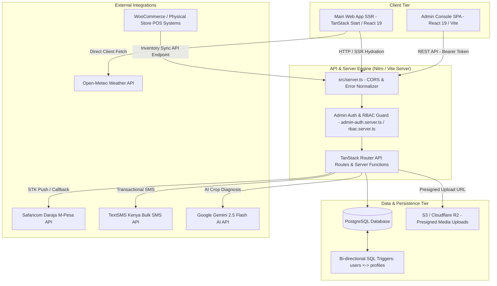
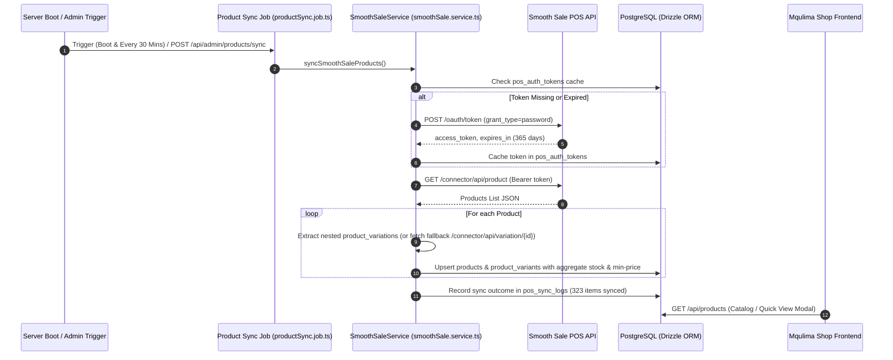

# Mqulima (Kirgit Agri) — Architectural Master Ledger & System Audit Findings

> **Document Purpose**: This document serves as the living architectural reference, system topology audit, and findings ledger for the Mqulima platform. All structural reviews, technical debt discoveries, integration contracts, and architectural decisions are recorded here for ongoing maintenance and evolution.

---

## 1. System Overview & Platform Topology

**Mqulima (Kirgit Agri)** is a multi-tenant agricultural technology and e-commerce platform tailored for East African farmers, agro-dealers, and agribusinesses. Built as a monorepo workspace (`npm` / `bun` workspaces), the platform consists of a public SSR web application, a client-side Admin Console SPA (`/admin`), an API layer powered by Nitro/Vite HTTP server handlers and TanStack Start server functions, and a PostgreSQL database managed via raw SQL query pooling alongside Drizzle ORM schemas.

### Top-Level Component Diagram



---

## 2. Directory Structure & Workspaces

```
mkulima-hub-c7714688/
├── admin/                         # Standalone Admin Console SPA Workspace
│   ├── src/
│   │   ├── components/
│   │   │   ├── auth/              # AdminLoginScreen
│   │   │   ├── layout/            # Topbar, Sidebar (Obsidian-Emerald styling)
│   │   │   └── modules/           # 14 lazy-loaded administrative management modules
│   │   ├── lib/api.ts             # Central adminFetch client attaching Bearer tokens
│   │   └── App.tsx                # Session manager & module switcher
│   ├── vite.config.ts             # Admin Vite configuration (Port 8081, /api proxy)
│   └── package.json               # Independent admin package declaration
├── db/
│   ├── migrations/                # 47 SQL schema migration files
│   ├── scripts/                   # Migration & seeding execution scripts
│   ├── seeds.sql                  # Primary seed dataset (products, courses, news)
│   └── seeds_courses.sql          # Academy course seed dataset
├── src/
│   ├── components/                # Modular UI components (mqulima, shop, community, ui)
│   ├── db/
│   │   ├── schema/                # Drizzle ORM table schemas (users, profiles, products, etc.)
│   │   └── repositories/          # DB query helper modules
│   ├── features/                  # Domain-specific UI features (AI diagnostic, community)
│   ├── lib/
│   │   ├── api/                   # Server function implementations (*.server.ts)
│   │   ├── db.server.ts           # Global PostgreSQL connection pool (postgres driver)
│   │   ├── auth-server.ts         # User authentication & JWT management via `jose`
│   │   ├── rbac.server.ts         # Role-Based Access Control middleware
│   │   ├── mpesa-helpers.server.ts# Safaricom M-Pesa STK Push helper functions
│   │   ├── sms-service.server.ts  # TextSMS Kenya client with mock fallback mode
│   │   ├── weather-service.ts     # Open-Meteo API wrapper for 47 Kenyan counties
│   │   └── rate-limit.server.ts   # Upstash Redis rate-limiting service
│   ├── routes/
│   │   ├── api/                   # File-based REST API endpoints
│   │   │   ├── admin/             # 17 administrative REST endpoints
│   │   │   ├── mpesa/callback.ts  # Safaricom M-Pesa webhook callback listener
│   │   │   ├── shop/pos-sync.ts   # POS / WooCommerce inventory sync endpoint
│   │   │   ├── ai/chat.ts         # Gemini AI Crop Doctor endpoint
│   │   │   └── upload/presign.ts  # S3 presigned URL generator
│   │   ├── __root.tsx             # Root layout with AuthProvider & CartProvider
│   │   ├── index.tsx              # Public homepage (Hero Carousel, Stats Bar, Featured)
│   │   ├── shop.tsx & shop/       # Agro-marketplace, cart drawer & checkout flow
│   │   ├── ai.tsx                 # Crop Doctor interactive workspace
│   │   ├── academy.tsx            # Agricultural masterclass learning hub
│   │   └── community.tsx          # Social forum (Show/Pulse feeds)
│   ├── server.ts                  # Server entry point handling CORS & error normalization
│   └── router.tsx                 # TanStack Router initialization
├── ARCHITECTURE_AUDIT.md          # Comprehensive architectural audit report
├── architect.md                   # Living architectural findings ledger (This document)
├── package.json                   # Root package configuration (TanStack Start, React 19)
├── vite.config.ts                 # Main Vite SSR configuration
└── vercel.json                    # Deployment routing rules
```

---

## 3. Core Functional Capabilities & Domain Modules

### 1. Agro-Marketplace & POS Sync
- **Product Catalog**: Handles category hierarchies, product variants, inventory stock states (`active`, `out_of_stock`), price formatting, and brand details.
- **POS Inventory Sync Endpoint (`/api/shop/pos-sync`)**: REST endpoint enabling physical store POS terminals or WooCommerce instances to push stock and price updates.
  - Supports **Bearer Token**, **WooCommerce Consumer Key/Secret (Basic Auth)**, and **Query Parameter** authentication.
  - Executes atomic upserts into PostgreSQL: matches existing items by `slug` or `name`, updating stock and price, or creates new product records with auto-generated slugs.

### 2. M-Pesa Daraja Payment Engine
- **Workflow**:
  1. Client submits checkout request with phone number (`254XXXXXXXXX`).
  2. Backend requests OAuth token from Safaricom Daraja API (`/oauth/v1/generate`).
  3. Generates base64 STK password (`Shortcode + Passkey + Timestamp`) and dispatches `stkpush/v1/processrequest`.
  4. Records `pending` transaction in `payments` table.
  5. Safaricom POSTs callback payload to `/api/mpesa/callback`.
  6. Webhook verifies security token, parses `ResultCode`, updates `payments` status to `completed`/`failed`, updates matching `orders` record, and logs event.

### 3. AI Crop Doctor & Agronomy Advisory
- **Model**: Powered by Google Gemini 2.5 Flash vision API via `@google/genai`.
- **Functionality**: Analyzes uploaded plant photos or text descriptions, returning structured diagnostic JSON (identified disease, confidence score, organic remedies, chemical treatments, and prevention tips).
- **Fallback**: Incorporates an offline rule-based agronomic engine if the Gemini API key is missing or quota is exhausted.

### 4. Transactional SMS Engine
- **Vendor**: Integrated with **TextSMS Kenya** bulk SMS service (`https://sms.textsms.co.ke/api/services/sendsms/`).
- **Features**: Dispatches transactional alerts for user signups, order receipts, and payment confirmations.
- **Resilience**: Features `TEXTSMS_MOCK_MODE` fallback—if enabled or credentials are missing, logs simulated messages to `sms_logs` table without failing requests.

### 5. Social Community Forum & Moderation
- **Feeds**: Supports **Show** (farmer moment posts with images, tags, likes, and comments) and **Pulse** (agri-news updates).
- **Moderation**: Users can report inappropriate content; admin console includes a dedicated `ForumModerationModule` to review, flag, or purge content.

---

## 4. Database Schema & Data Architecture Findings

### Primary Table Matrix

| Table Name | Primary Key | Key Foreign Keys | Purpose / Responsibilities |
| :--- | :--- | :--- | :--- |
| `users` | `id` (UUID) | None | Farmer identity record (`phone_number`, `national_id`, `county`, `farming_type`) |
| `profiles` | `id` (UUID) | None | Unified user profiles (`role`, `avatar_url`, `reputation_score`, `username`) |
| `products` | `id` (UUID) | `category_id` → `product_categories.id` | Marketplace product catalog |
| `orders` | `id` (UUID) | `user_id` → `profiles.id`, `sales_agent_id` → `profiles.id` | Customer purchase orders |
| `order_items` | `id` (UUID) | `order_id` → `orders.id`, `product_id` → `products.id` | Order line items |
| `payments` | `id` (UUID) | `order_id` → `orders.id` | M-Pesa & manual transaction payment ledger |
| `quotations` | `id` (UUID) | `user_id` → `profiles.id` | Agribusiness price quotes |
| `show_posts` | `id` (UUID) | `author_id` → `profiles.id` | Community forum show posts |
| `show_comments`| `id` (UUID) | `post_id` → `show_posts.id`, `user_id` → `profiles.id` | Forum post comments |
| `agritech_news`| `id` (VARCHAR) | `author_id` | News articles & CMS content |
| `sms_logs` | `id` (UUID) | None | SMS dispatch telemetry log |

### Dual User Tables Architecture & Trigger Synchronization
User data is divided between `users` (Kenyan identity/farm details) and `profiles` (platform account/roles). They are kept in sync via PostgreSQL triggers:
- `sync_users_to_profiles()`: Executed `AFTER INSERT OR UPDATE OR DELETE ON users`.
- `sync_profiles_to_users()`: Executed `AFTER UPDATE ON profiles`.
- **Recursion Guard**: Both triggers check `IF pg_trigger_depth() > 1 THEN RETURN NEW; END IF;` to prevent infinite trigger loops.

---

## 5. Security, RBAC & Authentication Findings

### Role Hierarchy (`src/lib/rbac.server.ts`)
```
super_admin (Level 100)
 └── admin (Level 90)
      └── operations_manager (Level 80)
           └── finance (Level 75)
                └── content_editor (Level 70)
                     └── support_agent (Level 65)
                          └── sales_agent (Level 60)
                               └── retailer / farmer (Level 10)
```

### Session Management & CORS Security
- **User Sessions**: Encoded into an HTTP-Only `mq_session` JWT cookie signed using `jose` with `JWT_SECRET`.
- **Admin Sessions**: Admin SPA sends JWT Bearer tokens in the `Authorization` header. On HTTP `401`, client dispatches an `admin_unauthorized` event to clear storage and prompt re-login.
- **CORS Protection**: Enforced in `src/server.ts` by validating incoming `Origin` headers against allowed domain patterns (`www.mqulima.com`, `admin.mqulima.com`, local ports).

---

## 6. Recorded Technical Debt & Risk Ledger

> [!CAUTION]
> **Risk #1: Quotations Schema Table Collision**
> - **Issue**: `src/db/schema/orders.ts` maps table `"quotations"` with a `UUID` primary key, while `src/db/schema/admin.ts` maps table `"quotations"` (`adminQuotations`) with a `VARCHAR(255)` primary key.
> - **Impact**: Potential runtime errors in Drizzle ORM queries and migration generator conflicts.
> - **Action Required**: Rename `adminQuotations` schema table name to `admin_quotations`.

> [!WARNING]
> **Risk #2: Hardcoded JWT Fallback Secret**
> - **Issue**: `src/lib/config.server.ts` falls back to a hardcoded string if `JWT_SECRET` is omitted.
> - **Impact**: Risk of session token forgery if deployed without strict environment variable enforcement.
> - **Action Required**: Enforce strict startup exception if `JWT_SECRET` is missing in production environments.

> [!IMPORTANT]
> **Risk #3: Monolithic Community Route File (`src/routes/community.tsx`)**
> - **Issue**: Single file `src/routes/community.tsx` is over 320KB (>8,000 lines of code) housing full UI layouts, feed states, modals, and API calls.
> - **Impact**: High risk of accidental regression during edits, slow IDE syntax evaluation.
> - **Action Required**: Refactor into sub-components in `src/components/community/`.

---

## 8. Smooth Sale POS Integration System Architecture



### Key Integration Contracts & Features
1. **OAuth2 Password Grant Token Caching**:
   - Authentication token is fetched from `https://technolake.net/smooth-sale-pos/public/oauth/token` using `client_id=4`.
   - Token is persisted in `pos_auth_tokens` table and reused across requests until expired (5-minute safety margin).
   - On HTTP 401 Unauthorized, token cache is automatically invalidated and refreshed.
2. **Atomic Inventory & Variation Parity**:
   - Products are correlated using `external_product_id`.
   - Variations are tracked using `external_variation_id`, `sku`, and multi-store `location`.
   - Base pricing is calculated dynamically from the minimum variation price.
   - Aggregate `stock_qty` is calculated across all location stocks.
3. **Frontend Telemetry & User Experience**:
   - Integrated `ProductQuickViewModal` component into `src/routes/shop/index.tsx`.
   - Displays real-time POS stock availability, product variations selector, SKU code, location branch inventory, and "POS Synced" badge.

---

## 9. Change Log & Architectural Findings History

| Date | Category | Summary of Architectural Finding / Change | Status |
| :--- | :--- | :--- | :--- |
| **2026-09-01** | **Integration** | Completed Smooth Sale POS inventory sync integration. Created `SmoothSaleService`, `00052_smooth_sale_pos_integration.sql` schema migration, 30-min background cron job, manual sync trigger API endpoints, `/api/products` endpoints, and `ProductQuickViewModal` UI. | **Completed** |
| **2026-09-01** | **Initial Ledger** | Comprehensive codebase analysis recorded in `architect.md`. Documented monorepo architecture, POS sync API, M-Pesa webhook callback, dual-user table trigger sync, and top architectural risks. | **Logged** |

